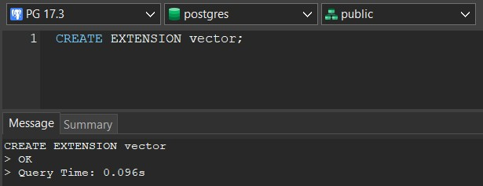
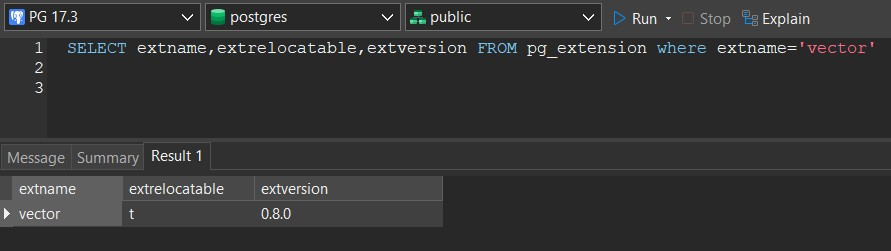

# [pgvector](https://github.com/pgvector/pgvector) binary compile, Microsoft Windows x64, PostgreSQL

<b>***** Unofficial release *****</b>
 Intended for individuals who encountered difficulties in compiling. 

See <a href="https://github.com/andreiramani/pgvector_pgsql_windows/releases">releases</a> for available version
  

<b>How to's v0.8.x</b>:
 
1. Check readme.txt (inside archive) 
 
<b>How to's v0.7.3, v0.7.4</b>:
 
1. Extracted zip file to "[pg_installed folder]\share\extension\" 
2. Activate extension with <code>create extension vector</code>
 
  
3. Run this query to check if the extension is enable (t)   <code>SELECT extname,extrelocatable,extversion FROM pg_extension where extname='vector'</code>
 

Contributor compiler: <a href="https://github.com/vjivandro">vjivandro</a> (v0.7.3, v0.7.4), <a href="https://github.com/andreiramani">andreiramani</a> (v0.8.0, v0.8.1)
